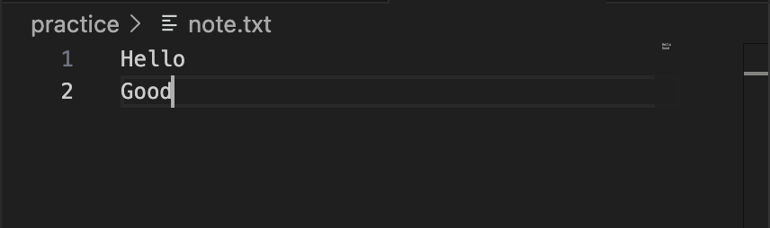

## 터미널 조작 로그 기록

### 현재 위치 확인
```
pwd
```
명령어:
```bash
chj09011500@c6r8s1 codyssey % pwd
```
출력 결과:
```bash
/Users/chj09011500/Desktop/codyssey
```
### 목록 확인(숨김 파일 포함)
#### 목록 확인
```
ls
```
명령어:
```bash
chj09011500@c6r8s1 codyssey % ls
```
출력 결과:
```bash
my-first-study
```
#### 목록 확인 (숨김 파일 포함)
```
ls -a
```
명령어:
```bash
chj09011500@c6r8s1 codyssey % ls -a
```
출력 결과:
```bash
.               ..              my-first-study
```
### 이동
```
cd
```
명령어:
```bash
chj09011500@c6r8s1 codyssey % cd my-first-study
```
출력 결과:
(이동 후 pwd로 위치 확인)
```bash
chj09011500@c6r8s1 my-first-study % pwd
/Users/chj09011500/Desktop/codyssey/my-first-study
```
### 폴더 생성
```
mkdir [폴더 이름]
```
명령어:
```bash
chj09011500@c6r8s1 my-first-study % mkdir practice
```
출력 결과:

### 파일 생성
```
touch [파일 이름]
```
명령어:
```bash
chj09011500@c6r8s1 practice % touch note.txt
```
출력 결과:

### 파일에 텍스트 추가
#### 덮어쓰기
```
echo "추가할 텍스트" > 파일이름.txt
```
명령어:
```
chj09011500@c6r8s1 practice % echo "Hello" > note.txt
```
출력 결과:

#### 이어쓰기
```
echo "추가할 텍스트" >> 파일이름.txt
```
명령어:
```
chj09011500@c6r8s1 practice % echo "Good" >> note.txt
```
출력 결과:

### 내용 확인
```
cat [파일 이름]
```
명령어:
```
chj09011500@c6r8s1 practice % cat note.txt
```
출력 결과:
```
Hello
Good
```


### 복사

### 이동/이름변경

### 삭제
