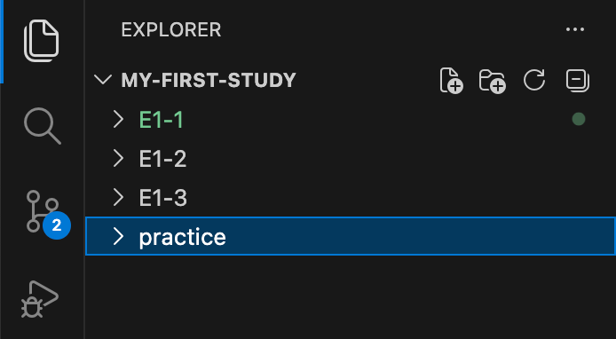
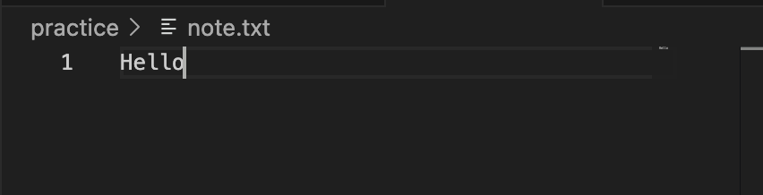
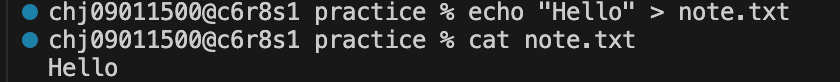
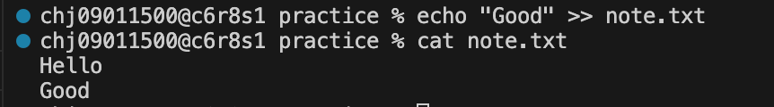

## 터미널 조작 로그 기록

### 현재 위치 확인
```bash
pwd
```
명령어:
```bash
pwd
```
출력 결과:
```bash
/Users/chj09011500/Desktop/codyssey
```
### 목록 확인(숨김 파일 포함)
#### 목록 확인
```bash
ls
```
명령어:
```bash
ls
```
출력 결과:
```bash
my-first-study
```
#### 목록 확인 (숨김 파일 포함)
```bash
ls -a
```
명령어:
```bash
ls -a
```
출력 결과:
```bash
.               ..              my-first-study
```
### 디렉터리 이동
```bash
cd
```
명령어:
```bash
cd my-first-study
```
출력 결과:
(이동 후 pwd로 위치 확인)
```bash
/Users/chj09011500/Desktop/codyssey/my-first-study
```
#### 상위 디렉터리 이동
```bash
cd ..
```
#### 절대경로와 상대경로
**절대경로**: 절대 경로는 파일의 전체 주소를 처음부터 끝까지 다 적어주는 방식

특징: 현재 내가 어디에 있든 상관없이 항상 같은 파일을 가리킴

ex. /home/user/documents/image.png

**상대경로**: '현재 내가 있는 위치'를 기준으로 파일의 위치를 나타내는 방식

특징: 내가 어디에 있느냐에 따라 경로가 달라짐

ex. (현재 내가 Documents 폴더에 있다고 가정):

같은 폴더 안의 파일: ./image.png (또는 그냥 image.png)

상위 폴더로 나갈 때: ../

하위 폴더(work) 안의 파일: ./work/report.pdf
```
. : 현재 내가 있는 폴더 (현재 위치)

.. : 현재 폴더의 상위 폴더 (부모 폴더)

/ : 폴더 내부로 들어갈 때 사용
```
### 디렉터리 생성
```bash
mkdir [폴더 이름]
```
명령어:
```bash
mkdir practice
```
출력 결과:

### 파일 생성
```bash
touch [파일 이름]
```
명령어:
```bash
touch note.txt
```
출력 결과:

### 파일에 텍스트 추가
#### 덮어쓰기
```bash
echo "추가할 텍스트" > 파일이름.txt
```
명령어:
```bash
echo "Hello" > note.txt
```
출력 결과:

#### 이어쓰기
```bash
echo "추가할 텍스트" >> 파일이름.txt
```
명령어:
```bash
echo "Good" >> note.txt
```
출력 결과:

### 파일 내용 확인
```bash
cat [파일 이름]
```
명령어:
```bash
cat note.txt
```
출력 결과:
```
Hello
Good
```


### 파일 복사
```bash
cp  [원본 파일] [복사할 파일]
```
명령어:
```bash
cp note.txt note-copy.txt
```
note.txt를 note-copy.txt라는 이름으로 복사

출력 결과:

### 이동/이름변경
#### 파일 이동
```bash
mv [파일명] [이동할 디렉터리]
```
명령어:
```bash
mv note.txt ~/Desktop/test
```
출력 결과:

note.txt를 test 디렉터리로 이동
#### 파일 이름 변경
```bash
mv [파일명] [변경할 파일명]
```
명령어:
```bash
mv note-copy.txt good-note.txt
```
출력 결과:

note-copy.txt를 good-note.txt로 파일 이름 변경
### 파일 삭제
```bash
rm [파일명]
```
명령어:
```bash
rm good-note.txt
```
출력 결과:

### 빈 디렉터리 삭제
```bash
rmdir [디렉터리명]
```
명령어:
```bash
rmdir practice
```