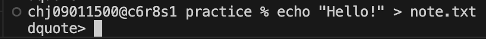
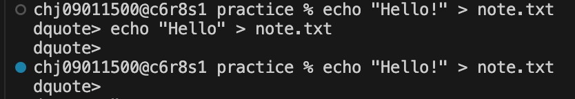
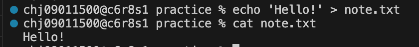
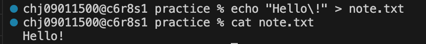

## 트러블슈팅
### VS Code에서 실수로 코드 전부 날아감
1. 단축키로 되돌리기

가장 최근에 입력한 키보드 동작이나 삭제 명령을 취소하기
```
Mac: Cmd + Z

Windows / Linux: Ctrl + Z
```
참고: 내용이 완전히 돌아올 때까지 이 단축키를 여러 번 연타해 보기

2. VS Code의 '타임라인(Timeline)' 기능으로 복구하기 (파일이 저장되어 버렸을 때)

만약 내용을 다 날린 상태에서 무심코 저장(Ctrl + S)까지 해버려서 Ctrl + Z가 안 먹는다면, VS Code가 자체적으로 백업해 둔 기록을 꺼내와야 함.
```
화면 왼쪽의 파일 탐색기(Explorer)를 열기

아래쪽을 보면 타임라인(Timeline) 섹션에 파일이 수정되었던 시간대별 기록이 남아있음. 이전 시간대의 기록을 클릭하면 과거 코드가 뜨는데, 여기서 코드를 복사해서 현재 파일에 붙여넣으면 됨.
```

3. Git의 힘을 빌리기 (가장 안전한 백업)

아직 커밋을 안 했고 파일만 저장한 경우:

터미널에 아래 명령어를 치면 방금 수정한 내용(날아간 상태)을 버리고 가장 최근에 커밋했던 안전한 상태로 되돌릴 수 있음.
```
Bash
git checkout [파일명]
또는
git restore [파일명]
```
주의: 날아간 이후에 작성했던 다른 소중한 코드까지 전부 초기화되므로, 정말 원본을 통째로 복구하고 싶을 때만 쓰기

### 터미널 사용 중 오류 해결
#### 문제

#### 원인
명령어를 입력할 때 쌍따옴표(")를 열기만 하고 마무리에 짝을 맞춰 닫아주지 않았거나, 내부에 특수문자(!) 등이 포함되어 있을 때 주로 발생
#### 확인
특수문자(!) 사용
#### 해결
현재 상태 탈출하기 (강제 중단)
```
ctrl + C
```
#### 문제

#### 원인
dquote> 프롬프트가 반복되거나 발생한 이유는 명령어에 포함된 느낌표(!) 때문
#### 확인
현재 사용 중인 맥(Mac) 터미널의 기본셸인 Zsh에서는 느낌표(!)를 히스토리 확장(History Expansion, 이전 명령어를 다시 불러오는 기능)을 위한 특수문자로 사용

Zsh의 특성:
Zsh는 쌍따옴표(") 안에서도 느낌표(!)를 특별한 문자로 인식
echo "Hello!"를 입력했을 때, 터미널은 !를 보고 "이전 명령어 중에 Hello로 시작하는 걸 찾아달라는 뜻인가?" 하고 혼동하거나 문법이 잘못되었다고 판단

dquote>가 나오는 이유:
이로 인해 따옴표 문맥이 깨지거나 명령어가 완성되지 않았다고 오인하여, 셸이 사용자가 따옴표를 마저 닫아주기를 기다리며 dquote>(Double Quote) 프롬프트를 띄우게 됨.
#### 해결
1. 작은따옴표(') 사용하기

Zsh는 작은따옴표 안에서는 히스토리 확장(!)을 무시하므로, 느낌표가 있어도 오류가 나지 않음.
```
echo 'Hello!' > note.txt
```
2. 역슬래시(\)로 느낌표 탈출시키기

큰따옴표를 꼭 써야 한다면 느낌표 앞에 백슬래시를 붙여 특수문자가 아님을 알려주기
```
echo "Hello\!" > note.txt
```

